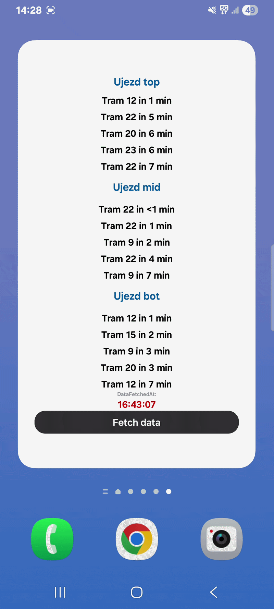
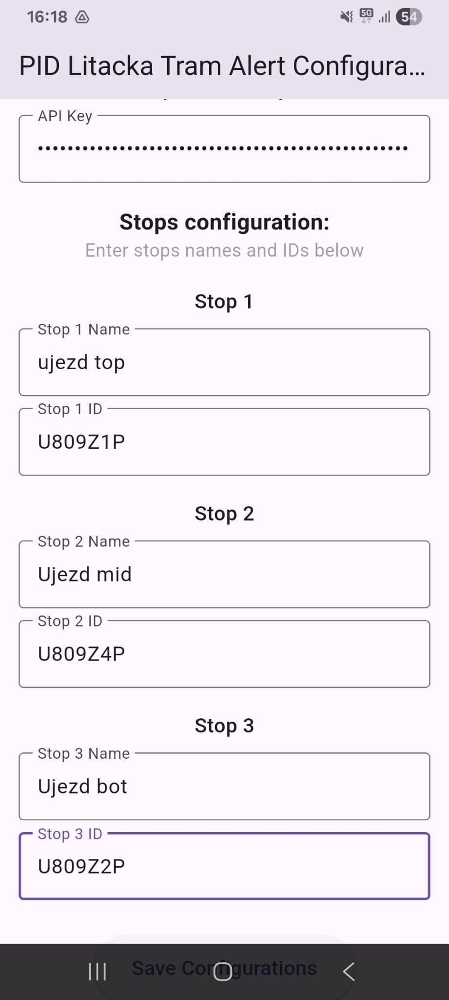

# Tram Alert Widget (PID Lítačka)

A Flutter app + Android home widget that shows upcoming tram departures from selected PID stops.

<table>
	<tr>
		<td align="center"></td>
		<td align="center"></td>
	</tr>
</table>

## Features

- Configure up to 3 stops (`name` + `stop ID`) from the app UI
- Save configuration and API key locally on device (`SharedPreferences`)
- Refresh widget from widget button via background task
- Show last update time and current departures

---

## Quick Start

1. Install dependencies:
	- `flutter pub get`
2. Run app:
	- `flutter run`
3. Build release APK:
	- `flutter build apk`

---

## How to get PID / Golemio API key

This app uses the Golemio transport API endpoint (`/v2/pid/departureboards`) and requires an access token.

1. Open Golemio developer portal:
	- https://api.golemio.cz/
2. Create an account / sign in.
3. Create an API token (access token).
4. Copy the token and paste it into the app field **API Key**.
5. Press **Save Configurations**.

The app stores this key locally on your device, so it persists across app restarts and phone reboots.

---

## Where to find stop IDs

You can look up PID stop IDs from the official stops dataset:

- Stops dataset (JSON):
  - https://data.pid.cz/stops/json/stops.json

How to use it:

1. Open the JSON file.
2. Search for your stop name.
3. Find the stop/platform identifier used for departures.
4. Copy that ID into the app field **Stop X ID**.
5. Press **Save Configurations**.

Tip: IDs often look similar to `U809Z1P`.

---

## TODO

- iPhone widget
- Let users choose preferred stations/stops more easily
- Add in-app mini tutorial for getting Golemio API key

---

## License

This project is licensed under the **MIT License**.
